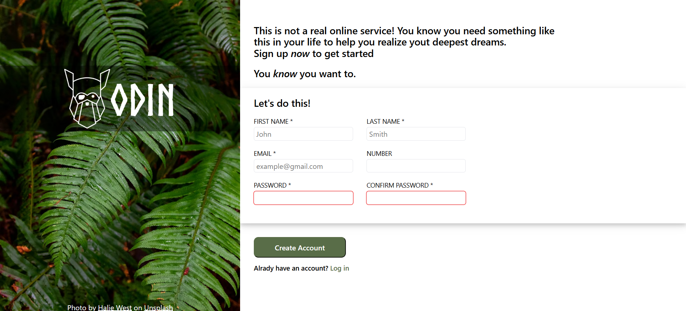

# Sign Up Form

This is first project of the Intermediate HTML and CSS course on [The Odin Project](https://www.theodinproject.com/paths/full-stack-javascript/courses/intermediate-html-and-css).

Demonstrates basic usage of forms and their validation in HTML.
NOTE: JavaScript validations aren't covered by this point in curriculum, all validations are only HTML validations. Responsive design isn't part of this project.

## What I used
- HTML5
- CSS3

## What I learned
- How to work with `position: absolute` and `position: relative`
- How to use custom fonts with `@font-face`
- How to make forms in HTML
- How to style them
- How to validate those forms with HTML
- CSS pseudo classes like invalid and focus
# Preview

# Live demo
[View live demo](https://dixon3o.github.io/sign-up-form)